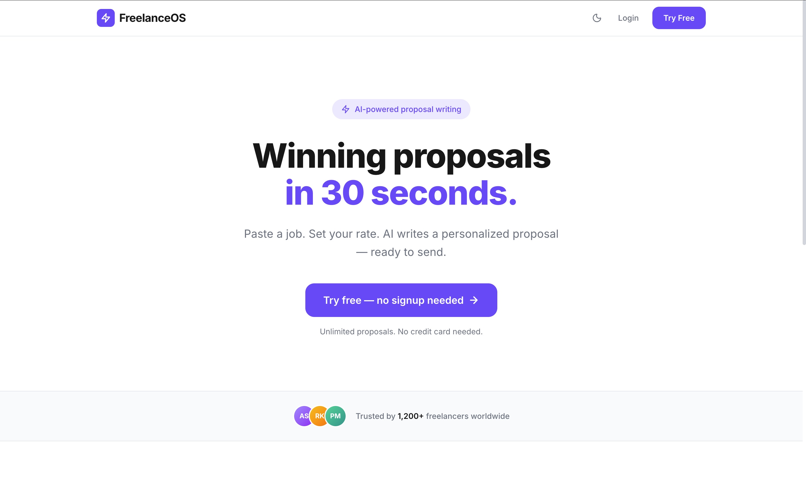

# 🚀 FreelanceOS — AI-Powered Agentic SaaS for Freelancers



## ✨ Overview
**FreelanceOS** is an autonomous, AI-driven SaaS platform designed specifically for the modern freelancer. It solves the most time-consuming part of freelancing: **proposal writing and administrative overhead.** 

Instead of spending 45 minutes crafting a single pitch, FreelanceOS allows users to paste a job description and generate a highly personalized, professional proposal, cover letter, contract, and invoice in **under 30 seconds**.

---

## 🧠 The Agentic Core: How it Works
Unlike standard chatbots, FreelanceOS operates using a **Multi-Agent Orchestration Pipeline**. When you provide a job description, 5 specialized AI agents work in sequence:

1.  **Context Gathering Agent**: Scans the job description to extract client industry, project type, tone expectations, and hidden signals.
2.  **Profile Matching Agent**: Searches the user's database (past wins, skills, experience) to find the most relevant "experience hooks" for this specific job.
3.  **Proposal Generation Agent**: Writes a concise (~150 words) pitch that feels human, references specific job details, and avoids generic templates.
4.  **Quality Check Agent**: A "Red Team" agent that reviews the draft against strict rules: no banned phrases, specific opening lines, and a soft CTA. It rewrites until it passes.
5.  **Learning Loop Agent**: Feeds "Won" or "Lost" signals back into the system, allowing the agents to evolve and become more effective for the user's specific niche over time.

---

## 🛠️ Tech Stack
- **Frontend**: [Next.js 15+](https://nextjs.org/) (App Router, Tailwind CSS, Lucide Icons)
- **Backend**: [Supabase](https://supabase.com/) (Auth, PostgreSQL, Row-Level Security)
- **AI Intelligence**: [Groq](https://groq.com/) with **Llama 3.3 70B** (Ultra-fast inference)
- **Agentic Logic**: Custom 400-word system prompts with strict structural constraints.
- **Payments**: [Razorpay](https://razorpay.com/) (Integration in progress for Phase 2)
- **Documents**: [jsPDF](https://github.com/parallax/jsPDF) for PDF generation.

---

## 🚀 Getting Started

### Prerequisites
- Node.js (v18+)
- Supabase Account
- Groq API Key

### Installation

1.  **Clone the repository**:
    ```bash
    git clone https://github.com/yourusername/FreelanceOS.git
    cd FreelanceOS
    ```

2.  **Install dependencies**:
    ```bash
    npm install
    ```

3.  **Set up Environment Variables**:
    Create a `.env.local` file in the root directory:
    ```env
    NEXT_PUBLIC_SUPABASE_URL=your_supabase_url
    NEXT_PUBLIC_SUPABASE_ANON_KEY=your_supabase_anon_key
    GROQ_API_KEY=your_groq_api_key
    ```

4.  **Database Setup**:
    Run the queries in `supabase_schema.sql` inside your Supabase SQL Editor to set up the tables and RLS policies.

5.  **Run the App**:
    ```bash
    npm run dev
    ```
    Open [http://localhost:3000](http://localhost:3000) to see the dashboard.

---

## 📈 Current Status & Roadmap
- [x] **MVP Phase**: Multi-agent proposal pipeline core logic.
- [x] **Database integration**: Storing proposals, profiles, and history.
- [ ] **Phase 2**: Authentication, payments (Razorpay), and analytics dashboard.
- [ ] **Phase 3**: Automated follow-up agents and client CRM.

---

## 💡 Why FreelanceOS?
Indian freelancers often waste hours on unpaid administrative tasks. FreelanceOS turns a **45-minute task into a 30-second workflow**, increasing win rates through hyper-personalization and allowing freelancers to focus on what they do best: **building.**

---

*Built with ❤️ for the Freelance Community.*
